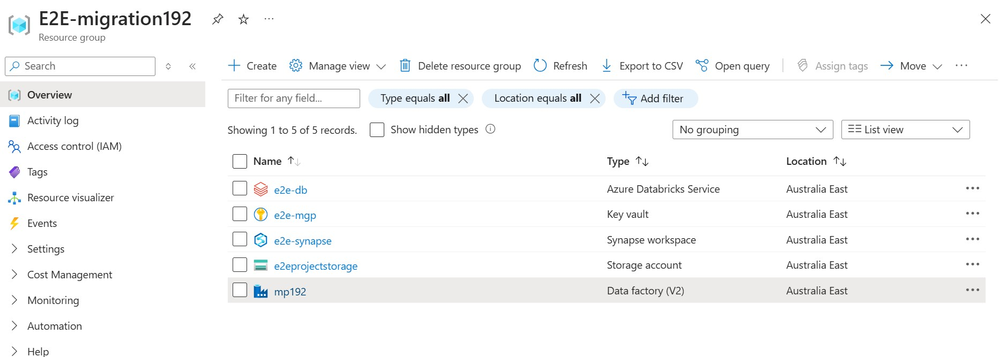

# Data Engineering projects

## MSSQL Server migration to Azure cloud

### Goal

The aim of the project was to migrate the local MS SQL server database of AdventureWorksLT to Azure data factory.
To perform Extract, transfrom and load using Azure services and perform basic analysis on the data.
The resources used in this project are-:
  1. Azure storage account (Data lake gen 2)
  2. Azure Key-vault
  3. Azure Synapse analytics
  4. Azure databricks
  5. Azure data factory
  6. Microsoft Power BI

### Steps followed
  1. Creating a resource group for all the resources used for this ETL project.
  2. Creating all the resources
       1. Azure storage account-: Choosing the appropriate cloud location,
          Choosing Hot tier as there would be frequent read and write operation,
          enabling the hierarchical namespaces so that you can build storage layers from the imported database.
       2. Azure Key-vault -: Key-vault objects can be used to share the username and password for on premise database servers
          or other servers which allows easy access and authentication to other azure services rather than manually entering
          credentials each time thus compromising abstraction.
          Creating *Secret* object of *username* and *password*, which is same as the local db user name and password.
       3. Azure Data Factory -: Creating the resource v2, navigating to *Acess control Management (IAM)* and *Add a role assignment*
          now add yourself to the role of administrator as when you will be using a enterprise Azure account or Azure student account.
          
  

  3. Creating a new user and password in the local database.
     ```
     CREATE LOGIN rohit WITH PASSWORD = 'password';
     create user rohit for login rohit
     ```
  4. Granting access to schema for the user, only SalesLT tables are being migrated rest are not needed.
     ```
     USE AdventureWorksLT2022;
     GRANT SELECT ON SCHEMA::SalesLT to rohit;
     ```
  5. Creating *bronze, silver and gold* folders in the Azure Storage account using the file explorer.
  6. Creating an *Integration runtime* for connecting the azure cloud to the on-premise database. Choosing *SQL Server* for the source
     and *Self-hosted integration runtime*. Choosing the *Express setup download* and Azure while configure the runtime by itself.
  7. Opening *Sql Server Configuration manager* and under *Protocols for SQL Server express* enable the *TCP/IP* to ensure conncetion
     between cloud and SSMS.
  8. Configuring the *Sink dataset* in ADF , we are using *Parquet files* and use Azure key-vault secrets for credentials.
     Test the connection.
  9. Creating an activity *lookup* in the pipeline , configure *Use query* , the *sys tables and sys schemas* have the schema
      and table name. Since we will be branching the brozne layer by schema > Table > parquet file , we use the following query 
     ```
      SELECT s.name as SchemaName,
      t.name as TableName
      FROM sys.tables t
      INNER JOIN sys.schemas s
      ON t.schema_id = s.schema_id
      WHERE s.name = 'SalesLT';
     ```
     https://github.com/rp192/dataengineer_portfolio/blob/7bd1f59290e2da613aee8b5af6e558e6945e2ef1/assets/lookup%20in%20ADF.jpg
  10.  The output of lookup is this json
        ```js
        // Json output.
        {
    	"count": 10,
    	"value": [
    		{
    			"SchemaName": "SalesLT",
    			"TableName": "Address"
    		},
    		{
    			"SchemaName": "SalesLT",
    			"TableName": "Customer"
    		},
    		{
    			"SchemaName": "SalesLT",
    			"TableName": "CustomerAddress"
    		},
    		{
    			"SchemaName": "SalesLT",
    			"TableName": "Product"
    		},
    		{
    			"SchemaName": "SalesLT",
    			"TableName": "ProductCategory"
    		},
    		{
    			"SchemaName": "SalesLT",
    			"TableName": "ProductDescription"
    		},
    		{
    			"SchemaName": "SalesLT",
    			"TableName": "ProductModel"
    		},
    		{
    			"SchemaName": "SalesLT",
    			"TableName": "ProductModelProductDescription"
    		},
    		{
    			"SchemaName": "SalesLT",
    			"TableName": "SalesOrderDetail"
    		},
    		{
    			"SchemaName": "SalesLT",
    			"TableName": "SalesOrderHeader"
    		}
    	],
    	"effectiveIntegrationRuntime": "SHIR",
    	"billingReference": {
    		"activityType": "PipelineActivity",
    		"billableDuration": [
    			{
    				"meterType": "SelfhostedIR",
    				"duration": 0.016666666666666666,
    				"unit": "Hours"
    			}
    		],
    		"totalBillableDuration": [
    			{
    				"meterType": "AzureIR",
    				"duration": 0.06666666666666667,
    				"unit": "Hours"
    			}
    		]
    	},
    	"durationInQueue": {
    		"integrationRuntimeQueue": 0
    	}
        }
            }
        ```
      
  11. Configuring the *for each loop* as we need to individually get each table to get the architecture we need.
      since from the last output , the useful information we need is in **value**
      ```js
        @activity('Lookup1').output.value
      ```
  
      
  12. Using *copy data* activity inside the for each loop , cofiguring the source with query and adding dynamic content
      ```js
        @{concat('SELECT * FROM ',item().SchemaName, item().TableName)}
      ```
  13. The debug logs observed using the montior function of ADF

  

  14. The output is seen in storage account, the database is migrated successfully and is as per the architecture,
      we designed. This happened because we enabled the *hierarchical namespace* in Data Lake Gen 2

  
      
      
